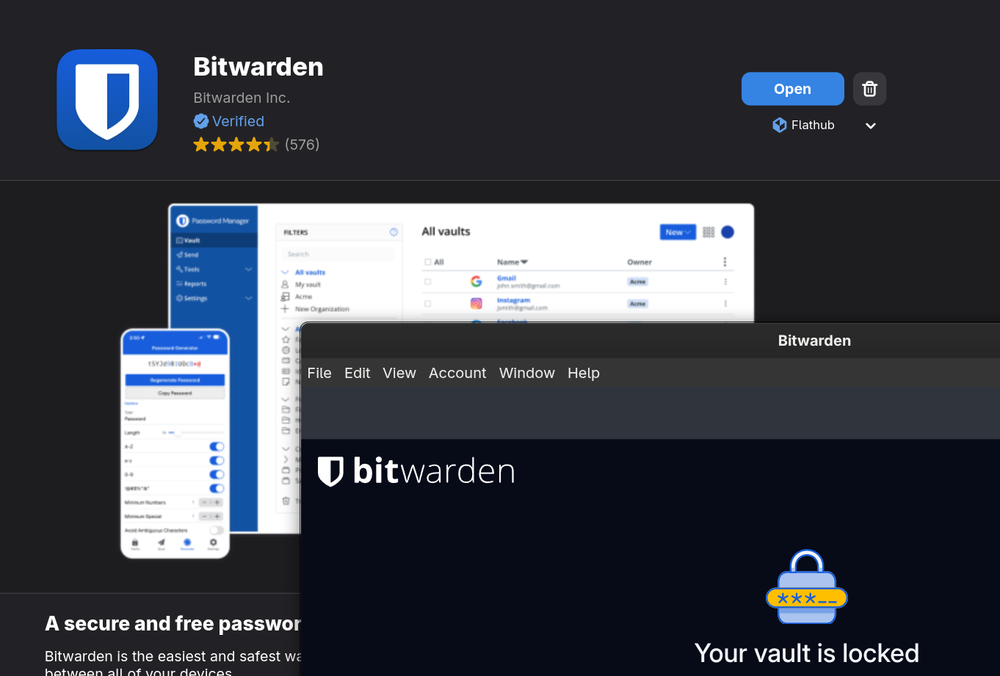
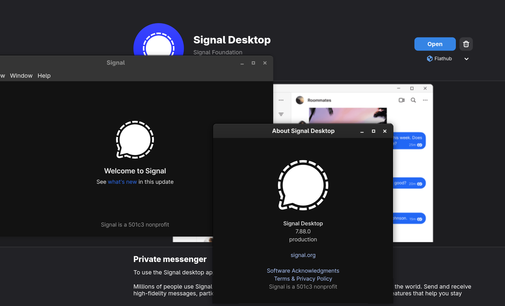

# Zephyrus-Linux

Nederlands | [English](README.md)

> **Disclaimer:** Dit is een onafhankelijk persoonlijk project waarin ik mijn eigen onderzoek en bevindingen documenteer bij het opzetten van Fedora 43 op mijn ASUS ROG Zephyrus G16 GA605WV (2024). Ik ben niet gelieerd aan, goedgekeurd door, of handelend namens Microsoft, Windows, ASUS, ROG, G-Helper, of enig ander bedrijf of project dat hier wordt genoemd. Deze repository deelt mijn persoonlijke configuratie en troubleshooting-aantekeningen. Geen stabiliteitgarantie wordt gegeven. Jouw resultaten kunnen afwijken.

---

## tl;dr

In 2026 ben ik naar Fedora 43 gegaan op mijn Zephyrus G16. Het is niet perfect, maar de stabiliteit zit dicht bij Windows 11 Pro en ik heb weer controle over mijn systeem.

Deze repo bevat de concrete stappen, tweaks en workarounds die ik gebruikt heb. Ik werk hem bij als Fedora en de drivers veranderen.

---

## Installatie & Configuratie

Complete setup guide voor de ROG Zephyrus G16 op Fedora Linux. Klik op een onderdeel om de details te zien.

<details>
<summary><strong>1.</strong> Brave browser installeren (Flathub)</summary>

Ik heb Brave geïnstalleerd via Flathub. De officiële `.sh` script versie van Brave's website crashte regelmatig en wilde soms niet meer openen. De Flatpak versie werkt stabiel.

**Installatie:**
- Open GNOME Software Center
- Zoek naar "Brave"
- Klik op Installeren
{width="400px"}
</details>

<details>
<summary><strong>2.</strong> Hostname instellen</summary>

Ik heb de hostnaam in de systeeminstellingen gezet naar de gewenste naam.

</details>

<details>
<summary><strong>3.</strong> GNOME vensterknoppen configureren</summary>

Ik heb de venster-knoppen in GNOME 49 aangepast om minimize, maximize en close knoppen te tonen. Standaard toont GNOME alleen de close knop.


**Configuratie:**
```bash
gsettings set org.gnome.desktop.wm.preferences button-layout 'appmenu:minimize,maximize,close'
```

Dit zorgt ervoor dat alle drie de vensterknoppen (minimize, maximize/zoom, en close) zichtbaar zijn in de titelbalk van applicaties, vergelijkbaar met andere desktop-omgevingen.
</details>

<details>
<summary><strong>4.</strong> Bitwarden desktop (Flathub)</summary>

Ik heb de Bitwarden desktop-app geïnstalleerd via Flathub.

</details>

<details>
<summary><strong>5.</strong> Signal Messenger (Flathub)</summary>

Signal Messenger geïnstalleerd via Flathub. Mijn voorkeurs-app voor messaging. Officieel is Signal alleen voor Debian/Ubuntu, maar de Flatpak versie werkt prima op Fedora. Signal is gebouwd op Electron, dus biedt goede prestaties.

</details>

<details>
<summary><strong>6.</strong> Git installeren</summary>

Git is nodig om met repositories te werken en commits te doen (anders had ik deze repo niet kunnen aanmaken). Op Fedora wordt Git standaard meegeïnstalleerd als onderdeel van het systeem. Mocht het om wat voor reden dan ook niet geïnstalleerd zijn, dan kan het handmatig met:

```bash
sudo dnf install git
```
</details>

<details>
<summary><strong>7.</strong> Proton Mail (Flathub wrapper)</summary>

Proton Mail geïnstalleerd via Flathub. Dit is een wrapper. Sommige apps zijn wrappers en geen officiële native apps, maar voor webgebaseerde mail-apps vind ik dat acceptabel.

</details>

<details>
<summary><strong>8.</strong> Visual Studio Code installeren</summary>

Ik heb Visual Studio Code geïnstalleerd volgens de officiële instructies: https://code.visualstudio.com/docs/setup/linux

Op Fedora gebruikte ik de RPM-repo en Microsoft GPG key. Commands die ik gebruikte:

```bash
# Microsoft GPG key importeren en repo toevoegen
sudo rpm --import https://packages.microsoft.com/keys/microsoft.asc

echo -e "[code]\nname=Visual Studio Code\nbaseurl=https://packages.microsoft.com/yumrepos/vscode\nenabled=1\nautorefresh=1\ntype=rpm-md\ngpgcheck=1\ngpgkey=https://packages.microsoft.com/keys/microsoft.asc" | sudo tee /etc/yum.repos.d/vscode.repo > /dev/null

# Repo cache updaten
dnf check-update

# VS Code installeren
sudo dnf install code
```

> **Known issue:** Op kernel 6.18.x kan hardware acceleration in VS Code een amdgpu page fault veroorzaken. Zet hardware acceleration uit. Zie de [NVIDIA Driver Installation Guide](nvidia-driver-installation.nl.md).
</details>

<details>
<summary><strong>9.</strong> Kleopatra & git commit signing</summary>

Na het installeren van VS Code en Git heb ik `kleopatra` geïnstalleerd en via de GUI mijn GPG-keys aangemaakt. Daarna heb ik Git geconfigureerd om commits en tags te ondertekenen.

**EENMALIGE SETUP:**
```bash
git config --global user.name "Sten Tijhuis"
git config --global user.email "102481635+Stensel8@users.noreply.github.com"
git config --global user.signingkey 8E3B0360FED269E75261AC73D13D72C854C880F3
git config --global commit.gpgsign true
git config --global tag.gpgsign true
git config --global gpg.program gpg
```

Dit zorgt ervoor dat mijn commits automatisch met mijn GPG-key gesigneerd worden.
</details>

<details>
<summary><strong>10.</strong> Tidal Hifi (Electron)</summary>

Ik heb uiteindelijk de Tidal Hifi Electron-app geïnstalleerd van: https://github.com/Mastermindzh/tidal-hifi/releases/tag/6.1.0

Ik gebruik deze app voor mijn muziek; er is geen officiële Linux-client, dus de community Electron-versie werkt prima voor hi-res afspelen.
</details>

<details>
<summary><strong>11.</strong> NVIDIA GPU drivers installeren</summary>

De RTX 4060 heeft proprietary NVIDIA drivers nodig voor goede prestaties. Nouveau (open-source) werkt slecht voor moderne GPU's.

Volledige installatie handleiding: [NVIDIA Driver Installation Guide](nvidia-driver-installation.nl.md)

**Samenvatting:**
- Installeer NVIDIA driver 580.119.02 via RPM Fusion
- MOK enrollment voor Secure Boot
- Kernel parameter voor AMD GPU crash fix (externe monitors)

Na installatie werkt de GPU correct met Wayland en CUDA 13.0 support.
</details>

<details>
<summary><strong>12.</strong> Bottles installeren (Flathub)</summary>

Windows apps draaien via Wine.

**Installatie:**
- Open GNOME Software Center
- Zoek naar "Bottles"
- Klik op Installeren

Voor Microsoft 365 is een Windows VM nodig.


</details>

<details>
<summary><strong>13.</strong> Archi installeren (ArchiMate modelleertool)</summary>

Open-source ArchiMate tool.

**Installatie:**
```bash
# Download en extract in één flow
cd /tmp
curl -L https://github.com/archimatetool/archi.io/releases/download/5.7.0/Archi-Linux64-5.7.0.tgz | tar -xz

# Move naar /opt
sudo mv Archi-Linux64-5.7.0/Archi /opt/

# Cleanup
rm -rf Archi-Linux64-5.7.0
cd ~

# Symlink naar PATH
sudo ln -s /opt/Archi/Archi /usr/local/bin/archi
```

**Desktop entry aanmaken:**
```bash
sudo nano /usr/share/applications/archi.desktop
```

**Desktop entry content:**
```ini
[Desktop Entry]
Version=1.0
Type=Application
Name=Archi
Comment=ArchiMate Modelling Tool
Exec=/opt/Archi/Archi
Icon=/opt/Archi/plugins/com.archimatetool.editor_5.7.0.202509230807/img/app-128.png
Terminal=false
Categories=Development;IDE;
StartupWMClass=Archi
```
</details>

<details>
<summary><strong>14.</strong> Windows 11 VM opzetten met virt-manager (KVM/QEMU)</summary>

Voor apps die niet onder Wine/Bottles draaien (zoals Microsoft 365) kun je een Windows 11 VM opzetten.

Volledige setup guide: [VM Setup Guide](vm-setup.nl.md)

**Samenvatting:**
- Windows 11 IoT Enterprise LTSC
- virt-manager met KVM/QEMU
- VirtIO drivers en SPICE
</details>

<details>
<summary><strong>15.</strong> Steam installeren voor gaming</summary>

Installeer Steam via RPM Fusion.

**RPM Fusion repositories activeren:**
```bash
sudo dnf install https://download1.rpmfusion.org/free/fedora/rpmfusion-free-release-$(rpm -E %fedora).noarch.rpm
sudo dnf install https://download1.rpmfusion.org/nonfree/fedora/rpmfusion-nonfree-release-$(rpm -E %fedora).noarch.rpm
```

**Steam installeren:**
```bash
sudo dnf install steam
```

Herstart na installatie:
```bash
sudo reboot
```
</details>

<details>
<summary><strong>16.</strong> Solaar installeren voor Logitech apparaten</summary>

Ik heb Solaar geïnstalleerd om mijn Logitech-apparaten te beheren. Met Solaar kun je Logitech-apparaten die gebruikmaken van de Unifying USB-ontvanger of Bluetooth configureren en monitoren. Zo kun je o.a. het batterijniveau van je Logitech-apparaten zien.

**Installatie via DNF:**
```bash
sudo dnf install solaar
```

**Gebruik:**
- Start via Applications menu: zoek "Solaar"
- Via terminal: `solaar`

**Functies:**
- Batterijniveau monitoren van Logitech-apparaten
- Configureren van DPI, polling rate, en knoppen
- Beheer van meerdere apparaten op één Unifying-ontvanger
- Ondersteuning voor zowel Unifying als Bluetooth-apparaten

Solaar draait als een systray-applicatie en toont notificaties wanneer de batterij van een apparaat bijna leeg is.
</details>

<details>
<summary><strong>17.</strong> GNOME sneltoetsen instellen (Windows-stijl)</summary>

Om de overgang van Windows soepeler te maken, heb ik een aantal sneltoetsen ingesteld die vergelijkbaar zijn met de Windows-shortcuts die ik fijn vond.

**Ingebouwde sneltoetsen (via Settings > Keyboard > Keyboard Shortcuts):**

| # | Actie | Sneltoets | Categorie |
|---|-------|-----------|-----------|
| 1 | Desktop tonen (alle vensters verbergen) | `Super+D` | Navigation |
| 2 | Screenshot interactief maken | `Shift+Super+S` | Screenshots |
| 3 | Instellingen openen | `Super+I` | System |

**Custom shortcut (via Settings > Keyboard > Keyboard Shortcuts > Custom Shortcuts):**

| # | Actie | Commando | Sneltoets |
|---|-------|----------|-----------|
| 4 | Bestandsbeheer openen | `nautilus` | `Super+E` |

De custom shortcut voor de bestandsbeheerder moet handmatig worden aangemaakt omdat GNOME hier geen standaard sneltoets voor heeft. Ga naar Settings > Keyboard > Keyboard Shortcuts > Custom Shortcuts en klik op "Add Shortcut" om deze toe te voegen.
</details>

<details>
<summary><strong>18.</strong> Touchpad scroll speed aanpassen (optioneel)</summary>

GNOME op Wayland heeft geen scroll-speed instelling. Workaround: [libinput-config](https://github.com/lz42/libinput-config) (third-party).

**Installatie (éénmalig):**

```bash
# 1. Dependencies installeren
sudo dnf install -y meson ninja-build libinput-devel git

# 2. libinput-config clonen
git clone https://github.com/lz42/libinput-config.git
cd libinput-config

# 3. Bouwen
meson setup build
ninja -C build

# 4. Installeren in het systeem
sudo ninja -C build install

# 5. Opruimen (optioneel)
cd ..
rm -rf libinput-config
```

**Configuratie voor langzamere touchpad scroll:**

```bash
sudo tee /etc/libinput.conf >/dev/null << 'EOF'
# libinput-config configuration
override-compositor=enabled

# Maak touchpad-scroll trager (lager = trager)
# Standaard: 1.0, geteste waarde: 0.25
scroll-factor=0.25

# Laat muiswieltjes normaal gedrag houden
discrete-scroll-factor=1.0
EOF
```

Log uit en weer in (of reboot) en pas `scroll-factor` aan naar voorkeur.

**Scroll speed later aanpassen:**

```bash
# Edit de config
sudo nano /etc/libinput.conf

# Pas scroll-factor aan naar wens
# Sla op met Ctrl+O, Enter, Ctrl+X
# Log uit en weer in (of reboot)
```

**Rollback:**

```bash
sudo rm /etc/libinput.conf
```
</details>
